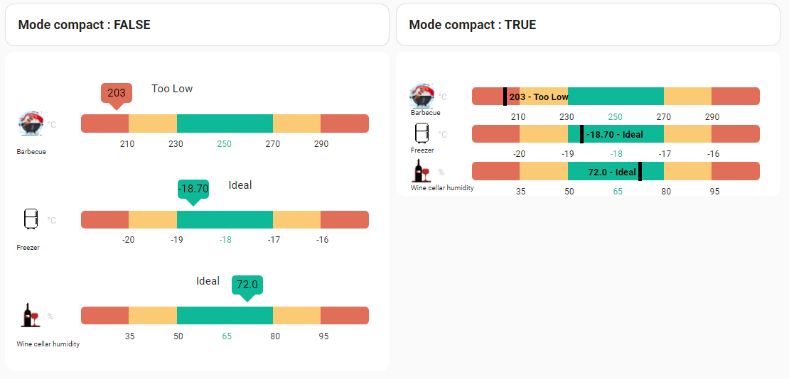

# Sensor Monitor Card

[![Release][release-shield]][release-link] [![HACS][hacs-shield]][hacs-link] [![GitHub Activity][commits-shield]][commits-link]

> A fully customizable monitoring card — define your own sensors, units, setpoints, and thresholds for any use case.



---

## Why this card?

Unlike the domain-specific cards, Sensor Monitor Card has **no predefined sensors**. You define everything: names, units, ranges, and icons.

Perfect for monitoring **anything** the specialized cards don't cover: server rooms, greenhouses, wine cellars, 3D printers, energy systems, and more.

Same powerful rendering engine as the domain cards — gradient bars, color ranges, compact mode, 12 languages.

### What you can do

- Monitor **server room** temperature, humidity, and UPS battery level
- Track **solar panel** production vs. household consumption
- Display **ESP32/ESPHome** custom sensor data with meaningful thresholds
- Build a dashboard for your **greenhouse**: soil moisture, light, temperature
- Monitor **3D printer** bed and nozzle temperatures during prints
- Track **wine cellar** temperature and humidity for proper aging

---

## Sensors — You Define Them

No predefined sensors. Each sensor you add accepts:

| Option | Required | Description |
|--------|:--------:|-------------|
| `entity` | **yes** | Home Assistant entity ID |
| `name` | | Display name |
| `unit` | | Unit of measurement |
| `setpoint` | | Ideal target value |
| `min` / `max` | | Expected range |
| `step` | | Color threshold step size |
| `mode` | | `centric` (ideal = center) or `heatflow` (gradient) |
| `icon` | | MDI icon name |

---

## Installation

### HACS (recommended)

1. Open [HACS](https://hacs.xyz/) → **Frontend** → search for **Sensor Monitor Card**
2. Install and reload your browser

[](https://my.home-assistant.io/redirect/hacs_repository/?owner=wilsto&repository=sensor-monitor-card&category=plugin)

### Manual

1. Download `sensor-monitor-card.js` from the [latest release](https://github.com/wilsto/sensor-monitor-card/releases)
2. Copy to `config/www/community/sensor-monitor-card/`
3. Add resource: `/local/community/sensor-monitor-card/sensor-monitor-card.js` (type: module)

---

## Quick Start

```yaml
type: custom:sensor-monitor-card
title: "My Sensors"
sensors:
  room_temp:
    entity: sensor.room_temperature
    name: Room Temperature
    unit: "°C"
    setpoint: 21
    step: 1
  server_cpu:
    entity: sensor.server_cpu_temp
    name: Server CPU
    unit: "°C"
    setpoint: 50
    step: 10
    icon: mdi:cpu-64-bit
```

That's it! The card uses sensible defaults for everything else.

---

## Configuration

| Option | Type | Default | Description |
|--------|------|---------|-------------|
| `title` | string | — | Card title |
| `sensors` | object | — | Sensor definitions (see below) |
| `display.compact` | boolean | `false` | Compact display mode |
| `display.show_names` | boolean | `true` | Show sensor names |
| `display.show_icons` | boolean | `true` | Show sensor icons |
| `display.show_units` | boolean | `true` | Show units |
| `display.show_labels` | boolean | `true` | Show range labels |
| `display.gradient` | boolean | `true` | Show gradient bar |
| `display.show_last_updated` | boolean | `false` | Show last update time |
| `display.show_icons` | boolean | `true` | Show sensor icons |
| `language` | string | `en` | Language code |

### Per-sensor overrides

```yaml
sensors:
  my_sensor:
    entity: sensor.xxx        # required
    name: Custom Name         # override display name
    unit: "°C"                # override unit
    setpoint: 25              # ideal value
    min: 10                   # min of the range
    max: 40                   # max of the range
    step: 2                   # threshold step for colors
    icon: mdi:thermometer     # MDI icon
    mode: centric             # centric | heatflow
```

### Multiple sensors of the same type

```yaml
sensors:
  temperature:
    - entity: sensor.sensor_1
      name: Location 1
    - entity: sensor.sensor_2
      name: Location 2
```

### Languages

12 languages supported: 🇬🇧 English, 🇫🇷 French, 🇩🇪 German, 🇪🇸 Spanish, 🇮🇹 Italian, 🇵🇹 Portuguese, 🇳🇱 Dutch, 🇵🇱 Polish, 🇨🇿 Czech, 🇸🇰 Slovak, 🇮🇱 Hebrew, 🇷🇺 Russian.

---

## Support

[](https://bmc.link/wilsto)

## Monitor Cards Family

This card is part of the **monitor-cards** family — same rendering engine, same features, different presets:

| Card | For | Sensors |
|------|-----|---------|
| [Pool Monitor Card](https://github.com/wilsto/pool-monitor-card) | Pool & spa owners | 20 presets |
| [Aquarium Monitor Card](https://github.com/wilsto/aquarium-monitor-card) | Freshwater & saltwater aquarium keepers | 15 presets |
| [Air Quality Card](https://github.com/wilsto/air-quality-card) | Homeowners concerned about indoor air quality | 12 presets |
| [Sensor Monitor Card](https://github.com/wilsto/sensor-monitor-card) | Home Assistant power users | unlimited (custom) ← *you are here* |

<!-- Badges -->
[release-shield]: https://img.shields.io/github/v/release/wilsto/sensor-monitor-card?style=flat-square
[release-link]: https://github.com/wilsto/sensor-monitor-card/releases/latest
[hacs-shield]: https://img.shields.io/badge/HACS-Default-orange.svg?style=flat-square
[hacs-link]: https://hacs.xyz/
[commits-shield]: https://img.shields.io/github/commit-activity/y/wilsto/sensor-monitor-card?style=flat-square
[commits-link]: https://github.com/wilsto/sensor-monitor-card/commits/main