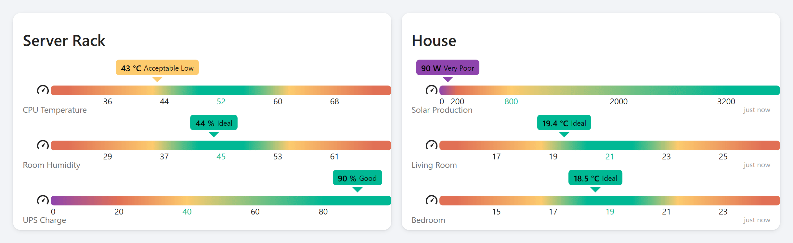

# Sensor Monitor Card

[![Release][release-shield]][release-link] [![HACS][hacs-shield]][hacs-link] [![GitHub Activity][commits-shield]][commits-link]

> A fully customizable monitoring card: define your own sensors, units, setpoints, and thresholds for any use case.



---

## Why this card?

Unlike the domain-specific cards, Sensor Monitor Card has **no predefined sensors**. You define everything: names, units, ranges, and icons.

Perfect for monitoring **anything** the specialized cards don't cover: server rooms, greenhouses, wine cellars, 3D printers, energy systems, and more.

Same powerful rendering engine as the domain cards: gradient bars, color ranges, compact mode, 12 languages.

### What you can do

- Monitor **server room** temperature, humidity, and UPS battery level
- Track **solar panel** production vs. household consumption
- Display **ESP32/ESPHome** custom sensor data with meaningful thresholds
- Build a dashboard for your **greenhouse**: soil moisture, light, temperature
- Monitor **3D printer** bed and nozzle temperatures during prints
- Track **wine cellar** temperature and humidity for proper aging

---

## Sensors: You Define Them

No predefined sensors. Each sensor you add accepts:

| Option | Required | Description |
|--------|:--------:|-------------|
| `entity` | **yes** | Home Assistant entity ID |
| `name` | | Display name |
| `unit` | | Unit of measurement |
| `setpoint` | | Ideal target value |
| `min` / `max` | | Expected range |
| `step` | | Color threshold step size |
| `mode` | | `centric` (ideal = center) or `heatflow` (gradient) |
| `icon` | | MDI icon name |

---

## Installation

### HACS (recommended)

1. Open [HACS](https://hacs.xyz/) → **Frontend** → search for **Sensor Monitor Card**
2. Install and reload your browser

[](https://my.home-assistant.io/redirect/hacs_repository/?owner=wilsto&repository=sensor-monitor-card&category=plugin)

### Manual

1. Download `sensor-monitor-card.js` from the [latest release](https://github.com/wilsto/sensor-monitor-card/releases)
2. Copy to `config/www/community/sensor-monitor-card/`
3. Add resource: `/local/community/sensor-monitor-card/sensor-monitor-card.js` (type: module)

---

## Quick Start

```yaml
type: custom:sensor-monitor-card
title: "My Sensors"
sensors:
  room_temp:
    entity: sensor.room_temperature
    name: Room Temperature
    unit: "°C"
    setpoint: 21
    step: 1
  server_cpu:
    entity: sensor.server_cpu_temp
    name: Server CPU
    unit: "°C"
    setpoint: 50
    step: 10
    icon: mdi:cpu-64-bit
```

That's it! The card uses sensible defaults for everything else.

---

## Configuration

| Option | Type | Default | Description |
|--------|------|---------|-------------|
| `title` | string | - | Card title |
| `sensors` | object | - | Sensor definitions (see below) |
| `status_entity` | string | - | Entity whose state is shown as a badge at the top of the card |
| `battery_entity` | string | - | One battery for the whole device, shown once beside the status |
| `display.compact` | boolean | `false` | Compact display mode |
| `display.show_names` | boolean | `true` | Show sensor names |
| `display.show_icons` | boolean | `true` | Show sensor icons |
| `display.show_units` | boolean | `true` | Show units |
| `display.show_labels` | boolean | `true` | Show range labels |
| `display.gradient` | boolean | `true` | Show gradient bar |
| `display.show_last_updated` | boolean | `false` | Show last update time |
| `display.name_font_size` | string | - | Font size of the sensor name, e.g. `0.8em` |
| `display.name_font_weight` | string | - | Font weight of the sensor name |
| `display.language` | string | `en` | Language code, one of the 17 shipped |
| `colors.*` | string | - | Any colour of the palette, see the Styling section |

### Per-sensor overrides

```yaml
sensors:
  my_sensor:
    entity: sensor.xxx        # required
    name: Custom Name         # override display name
    unit: "°C"                # override unit
    setpoint: 25              # ideal value
    min: 10                   # number = scale bound, string = tracking entity
    max: 40                   # same
    step: 2                   # threshold step for colors
    icon: mdi:thermometer     # MDI icon
    mode: centric             # centric | heatflow
```

Every option a sensor accepts:

| Option | Type | Description |
|--------|------|-------------|
| `entity` | string | **Required.** The entity to read |
| `attribute` | string | Read this attribute instead of the state. Missing attribute reads as unavailable rather than falling back |
| `name` | string | Override the displayed name |
| `unit` | string | Override the unit |
| `icon` | string | MDI icon, or `hide` to show none |
| `image_url` | string | Image instead of an icon |
| `setpoint` | number | The ideal value the bands are built around |
| `step` | number | Width of one band, so how tolerant the scale is |
| `step_low` | number | Band width below the setpoint, when it differs |
| `step_high` | number | Band width above the setpoint |
| `min_limit` | number | Lowest value the bar will show |
| `limits` | number[] | Four explicit boundaries. Replaces `setpoint` and `step`, which are then ignored |
| `direction` | string | `lower_is_better` (default) or `higher_is_better`, with `limits` |
| `mode` | string | `centric` or `heatflow`, when no preset decides it |
| `min` | number | string | Number = scale bound. String = entity placing a marker |
| `max` | number | string | Same |
| `status_entity` | string | A status for this measurement alone, shown as a badge beside it |
| `battery_entity` | string | Battery of this sensor. For one device with one battery, use the card-level option instead |
| `availability_entity` | string | Greys the row out when this entity is off |
| `setpoint_entity` | string | Reads the setpoint from an entity rather than a fixed number |
| `min_limit_entity` | string | Same, for `min_limit` |
| `last_updated_entity` | string | Where the measurement time comes from |
| `last_updated_attribute` | string | Attribute holding that time, e.g. PoolLab `measured_at` |

`min` and `max` accept two forms and the type decides: a **number** is a bound
of the visible scale, a **string** is an entity whose value places a tracking
marker on the bar.

Without them, the bar spans `setpoint ± 3 × step`, and the coloured zones
change every `step`. So `step` is what widens or narrows the green zone:
a larger `step` is more tolerant, a smaller one more strict.

### Quantities whose ideal is at one end

`centric` and `heatflow` both place the ideal value in the middle. For PM2.5,
where 0 is best, or ORP, where higher is better, give the four class
boundaries explicitly and say which way the scale reads:

```yaml
sensors:
  pm25:
    entity: sensor.pm25
    min: 0
    max: 20
    limits: [2, 5, 10, 15]    # four boundaries, replaces setpoint/step
    # direction: lower_is_better (default) | higher_is_better
```

### Multiple sensors of the same type

```yaml
sensors:
  temperature:
    - entity: sensor.sensor_1
      name: Location 1
    - entity: sensor.sensor_2
      name: Location 2
```

### Styling

The card renders a standard `ha-card`, so it responds to your Home Assistant
theme and to [card-mod](https://github.com/thomasloven/lovelace-card-mod) like
any other card.

**Transparent, borderless:**

```yaml
type: custom:sensor-monitor-card
card_mod:
  style: |
    ha-card {
      background: transparent;
      box-shadow: none;
      border: none;
    }
sensors: ...
```

**Sizes, colours, spacing**: target the classes below:

```yaml
card_mod:
  style: |
    .pool-monitor-title { font-size: 2rem !important; }
    .entity-icon { color: var(--error-color); }
    .gauge-scale { font-size: 1.1em !important; }
```

> **Why some rules need `!important`.** The card ships its styles as an
> adopted stylesheet, and those win over an injected one at equal
> specificity. So a property the card already sets (a font size, a bar
> height) needs `!important` or a more specific selector such as
> `h1.pool-monitor-title`. A property the card does **not** set, like the
> icon colour above, applies with no ceremony. Styling `ha-card` itself
> also works plainly: that rule crosses a shadow boundary, where the
> outer stylesheet wins.

| Class | What it is |
| --- | --- |
| `.pool-monitor-title` | Card title |
| `.entity-icon` / `.entity-icon-compact` | Sensor icon, normal and compact modes |
| `.gauge-scale` | Row of numbers under the bar |
| `.grid-item-text-box` | Sensor name and value |
| `.status-badge` | Status badge |
| `.battery-indicator` | Battery level indicator |
| `.progress-bar-child` | The coloured bar itself |
| `.cursor` / `.cursor-text` | Current-value marker and its label |

> Marker positions and colours are computed per reading and set inline, so
> they follow the sensor value rather than a stylesheet. Everything listed
> above is static and can be overridden.

### Languages

17 languages supported: Català, Čeština, Dansk, Deutsch, English, Español, Français, עברית, Magyar, Italiano, Nederlands, Português, Português (Brasil), Română, Русский, Slovenčina, Svenska.

Set one with `display.language`, or pick it in the visual editor.

---

## Support

[](https://bmc.link/wilsto)

## Monitor Cards Family

This card is part of the **monitor-cards** family: same rendering engine, same features, different presets:

| Card | For | Sensors |
|------|-----|---------|
| [Pool Monitor Card](https://github.com/wilsto/pool-monitor-card) | Pool & spa owners | 28 presets |
| [Aquarium Monitor Card](https://github.com/wilsto/aquarium-monitor-card) | Freshwater & saltwater aquarium keepers | 15 presets |
| [Air Monitor Card](https://github.com/wilsto/air-quality-card) | Homeowners concerned about indoor air quality | 13 presets |
| [Sensor Monitor Card](https://github.com/wilsto/sensor-monitor-card) | Home Assistant power users | unlimited (custom) ← *you are here* |

<!-- Badges -->
[release-shield]: https://img.shields.io/github/v/release/wilsto/sensor-monitor-card?style=flat-square
[release-link]: https://github.com/wilsto/sensor-monitor-card/releases/latest
[hacs-shield]: https://img.shields.io/badge/HACS-Default-orange.svg?style=flat-square
[hacs-link]: https://hacs.xyz/
[commits-shield]: https://img.shields.io/github/commit-activity/y/wilsto/sensor-monitor-card?style=flat-square
[commits-link]: https://github.com/wilsto/sensor-monitor-card/commits/main